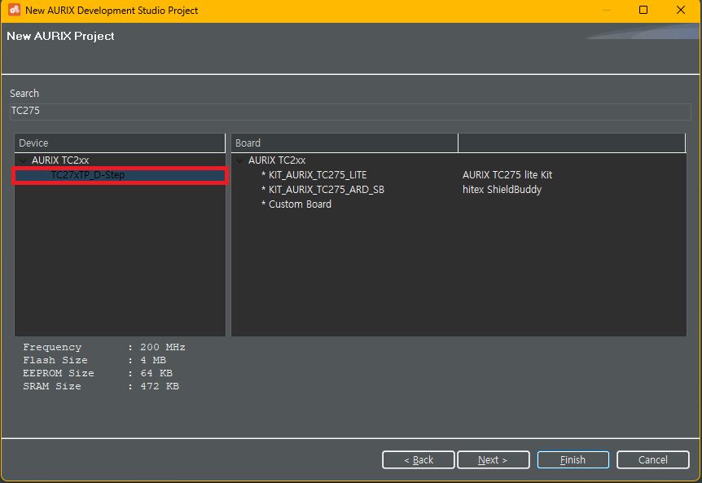

# Module_Dev


<hr>

### 기본 설정

#### 0. TC275D 설정



#### 1. Platform_Types.h 헤더 설정

- **Ifx_Types.h** 에서 **Platform_Types.h**로 이동
- **Platform_Types.h**에서 자료형 추가

```
// Platform_Types.h

#define PlATFORM_SW_PATCH_VERSION ...
...

// 다음 줄부터 추가

typedef signed char int8_t;
typedef unsigned char uint8_t;
typedef signed short int16_t;
typedef unsigned short uint16_t;
typedef signed long int32_t;
typedef unsigned long uint32_t;
typedef float float32_t;
typedef double float64_t;
```